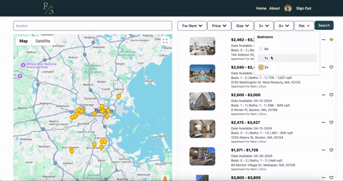
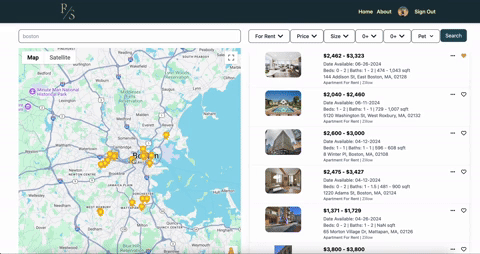
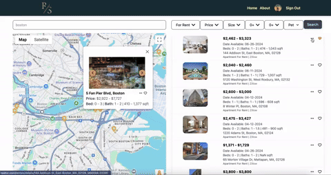

# 🏡 [Realty Savvy](https://realty-savvy-mern.onrender.com/)

Realty Savvy is a comprehensive real estate listing platform designed to enable users to easily find and browse real estate listings with enhanced search capabilities. Built with a modern tech stack, the application offers a robust and secure environment for both browsing and managing real estate properties.

## 🌟 Features

-   **User-Friendly Interface**: React front-end with Tailwind CSS for a responsive and modern design.
    
-   **Advanced Search**: Multiple filters and search functionality to easily find listings.
    

-   **Interactive Maps**: Integrated Google Maps to display property locations.
    

-   **Secure User Authentication**: Utilizes Google OAuth for authentication and JWT for session management.
    
-   **Real-Time Listings**: Integration with US Realtor API to fetch real-time property listings.
    
-   **Image Hosting**: Large property images are hosted using Firebase Cloud.

## 💻 Technology Stack

-   **Frontend**: React, Tailwind CSS, Redux
-   **Backend**: Node.js, Express
-   **APIs**: Google OAuth, [US Realtor API](https://rapidapi.com/DataCrawler/api/us-realtor), [Google Maps API](https://developers.google.com/maps)
-   **Database**: MongoDB Atlas
-   **Security**: JWT, bcryptjs, helmet, Express-session, Cookie-parser
-   **Hosting**: [Firebase Cloud](https://firebase.google.com/)

## Prerequisites

Before you start, ensure you have installed the following:

-   Node.js
-   npm (Node Package Manager)
-   Git (optional, for cloning the repository)

## Installation

To get started with the project, follow these steps:

```bash
# Clone the repository (optional)
git clone https://github.com/your-username/realty-savvy.git
cd realty-savvy

# Install dependencies
npm install

# Start the development server
npm start
```

## Configuration

Create a `.env` file in the root directory and update the following configuration settings:

```plaintext
REACT_APP_GOOGLE_MAPS_API_KEY=your_google_maps_api_key
REACT_APP_US_REALTOR_API_KEY=your_us_realtor_api_key
MONGO_DB_URI=your_mongodb_atlas_uri
JWT_SECRET=your_jwt_secret
```

## Usage

Once the application is running, you can access it locally or visit the deployed site for sample: [Realty Savvy](https://realty-savvy-mern.onrender.com/)

Navigate through the application to explore different properties and utilize the search and filter features to find properties that meet specific criteria.

## Contributors

Feel free to contribute to the project by submitting pull requests or issues. Any contributions you make are **greatly appreciated**.
